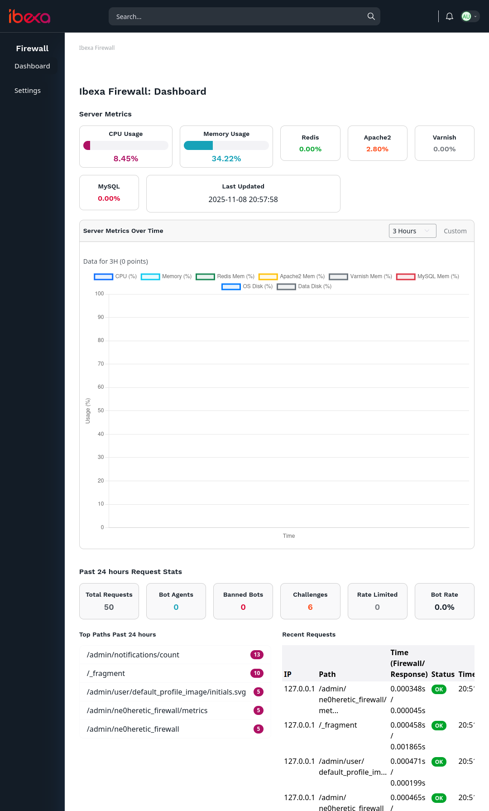
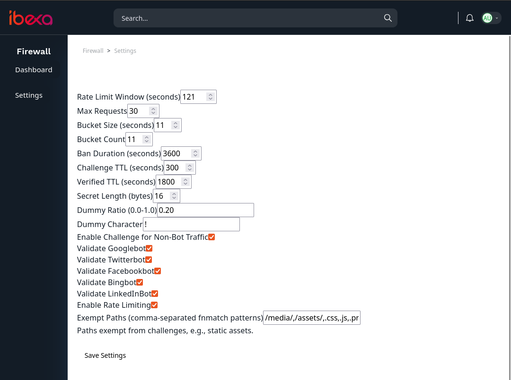
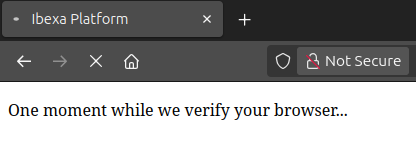

# Haeretici Firewall Bundle for Ibexa

A robust, configurable firewall bundle for [Ibexa CMS](https://ibexa.co/) (formerly eZ Platform) designed to protect against bots, DDoS attacks, and malicious traffic. It combines bot validation (via DNS checks for known crawlers), rate limiting, and a client-side JavaScript challenge to ensure only legitimate browsers proceed.

This bundle is lightweight, Redis-powered for caching, and integrates seamlessly with Ibexa's admin UI for monitoring and configuration.

## Features

| Feature                  | Description                                                                 | Configurable? |
|--------------------------|-----------------------------------------------------------------------------|---------------|
| **Bot Validation**      | Validates popular bots (Googlebot, Twitterbot, Facebookbot, Bingbot, LinkedInBot) using forward/reverse DNS checks. Fake bots are banned globally. | Yes (enable/disable per bot) |
| **Rate Limiting**       | Sliding-window rate limiting to prevent abuse. Exceeds limit? IP is temporarily banned. | Yes (window, max requests, min response time, ban duration) |
| **JS Challenge**        | JavaScript challenge (broken Base64 reversal + dummy chars) with basic anti-automation checks. Solves via cookies. | Yes (TTL, secret length, dummy ratio) |
| **Honeypot Traps**      | Instantly ban IPs that request known scanner/exploit paths. | Yes (paths, ban duration) |
| **Admin Dashboard**     | Real-time metrics, request logs, server stats (CPU, memory, disk). Powered by Doctrine and Redis. | N/A |
| **Exemptions**          | Skip challenges for static assets (e.g., `/media/*`, CSS/JS files) using fnmatch patterns. | Yes |
| **Persistence**         | Logs requests and metrics to DB; cron job for cleanup. Redis for fast checks. | N/A |
| **Security Policies**   | Ibexa policy integration for admin access control. | N/A |

## Requirements

- Ibexa CMS ^4.0 (or compatible Symfony 6/7)
- PHP ^8.1
- Redis (for caching and rate limiting)
- Doctrine DBAL (for logging)
- Composer
- Node.js / Yarn (to build admin UI assets via Symfony Webpack Encore in your Ibexa project)

## Installation

This bundle is installed manually into your Ibexa project. It does not yet ship a `composer.json` package — `composer require haeretici/firewall-bundle` will be available once the package is published.

1. **Copy the bundle into your project**

   Add a PSR-4 fallback autoload entry in your project's `composer.json`:

   ```json
   "autoload": {
       "psr-4": {
           "App\\": "src/",
           "": "bundles/"
       }
   }
   ```

   Then run `composer dump-autoload`.

   Copy this bundle folder to `bundles/Haeretici/FirewallBundle/` in your Ibexa project root.

2. **Enable the bundle**

   Add to `config/bundles.php`:

   ```php
   return [
       // ...
       Haeretici\FirewallBundle\HaereticiFirewallBundle::class => ['all' => true],
   ];
   ```

3. **Register routes**

   Copy `haeretici_firewall.yaml.sample` to `config/routes/haeretici_firewall.yaml`.

4. **Wire Webpack Encore**

   Merge the bundle's Encore config in your Ibexa project's webpack setup (typically by importing `bundles/Haeretici/FirewallBundle/Resources/encore/ibexa.config.js` from your main Encore config). Then rebuild assets:

   ```bash
   yarn encore dev
   ```

5. **Install runtime dependencies**

   - Ensure Redis is running and the `cache.redis` pool is configured in your Ibexa project.
   - Chart.js is already provided by Ibexa admin UI assets — no extra install needed.
   - `javascript-obfuscator` is **not** used by this bundle; the challenge script only randomizes variable names in PHP. You do not need to install it.

6. **Database setup**

   Execute the following SQL to create required tables:

   ```sql
   CREATE TABLE http_request_logs (
       id INT AUTO_INCREMENT PRIMARY KEY,
       ip VARCHAR(45) NOT NULL,
       path VARCHAR(255) NOT NULL,
       query TEXT,
       agent TEXT,
       firewallTime DECIMAL(10,6),
       responseTime DECIMAL(10,6),
       isBotAgent TINYINT(1) DEFAULT 0,
       isBannedBot TINYINT(1) DEFAULT 0,
       isChallenge TINYINT(1) DEFAULT 0,
       isRateLimited TINYINT(1) DEFAULT 0,
       timestamp DATETIME DEFAULT CURRENT_TIMESTAMP
   );

   CREATE TABLE server_metrics (
       id INT AUTO_INCREMENT PRIMARY KEY,
       cpu DECIMAL(5,2),
       memory DECIMAL(5,2),
       redis_mem DECIMAL(5,2),
       apache2_mem DECIMAL(5,2),
       varnish_mem DECIMAL(5,2),
       mysql_mem DECIMAL(5,2),
       os_disk DECIMAL(5,2),
       data_disk DECIMAL(5,2),
       timestamp DATETIME DEFAULT CURRENT_TIMESTAMP
   );

   CREATE TABLE firewall_config (
       id INT PRIMARY KEY DEFAULT 1,
       config JSON NOT NULL
   );
   ```

   Insert default config row:

   ```sql
   INSERT INTO firewall_config (id, config) VALUES (1, '{}');
   ```

7. **Configure policies**

   The bundle auto-registers policies via `PolicyProvider`. Grant admin access:

   - In Ibexa admin: **Admin** → **Roles** → [Your Role] → **Policies** → **Add Policy** → Module: `haeretici_firewall`, Function: `admin`.

8. **Set up cron job for data persistence**

   Add to crontab (runs every minute):

   ```bash
   * * * * * php bin/console ibexa:firewall:store
   ```

9. **Clear cache and restart**

   ```bash
   php bin/console cache:clear
   ```

10. **Access the admin UI**

    Log in to Ibexa admin, open the **Content** section in the left menu, then select the **Firewall** group. From there:

    - **Dashboard** — metrics and request stats
    - **Settings** — runtime configuration (saved to the database)

## Configuration

Publish and customize config in `config/packages/haeretici_firewall.yaml`:

```yaml
haeretici_firewall:
    rate_limiting:
        window: 121              # Seconds
        max_requests: 30
        min_response_time: 0.1     # Seconds; faster responses count toward rate limit
        ban_duration: 3600         # Seconds
    challenge:
        ttl: 300                   # Challenge expiration
        verified_ttl: 1800         # Per-browser verified TTL (HttpOnly HMAC cookie + Redis audit key)
        secret_length: 16          # Bytes
        dummy_ratio: 0.2
        dummy_char: '!'
        enabled_for_non_bots: false
    bots:
        google_enabled: true
        twitter_enabled: true
        facebook_enabled: true
        bing_enabled: true
        linkedin_enabled: true
    exemptions:
        paths:
            - '/_fragment*'
            - '/media/*'
            - '/assets/*'
            - '*.css'
            - '*.js'
    honeypot:
        enabled: true
        ban_duration: 86400
        paths:
            - '*/wp-admin*'
            - '*/wp-login.php'
            - '*/.env'
    enable_rate_limiting: true
```

For environment-specific overrides: `config/packages/prod/haeretici_firewall.yaml`.

**Settings UI**: Use **Content → Firewall → Settings** to tweak runtime options (persisted to the `firewall_config` database table).

## Usage

- **Monitoring**: Dashboard shows live stats, recent requests, and charts (via AJAX metrics endpoint).
- **Customization**: Extend `KernelListener` for custom bot patterns or challenge logic.
- **Cron maintenance**: The `ibexa:firewall:store` command flushes Redis logs to DB and prunes old data (7 days for requests, 90 days for metrics).
- **Demo data**: See [doc/seed-demo-data.md](doc/seed-demo-data.md) — run `php bin/console ibexa:firewall:seed-demo --clear` to populate the dashboard with test data.

## Screenshots


*Firewall Dashboard: Metrics and Recent Requests*


*Admin Settings: Configure Rate Limits and Challenges*


*Client-Side JS Challenge Screen*

## Contributing

1. Fork the repo.
2. Create a feature branch (`git checkout -b feature/AmazingFeature`).
3. Commit changes (`git commit -m 'Add some AmazingFeature'`).
4. Push to branch (`git push origin feature/AmazingFeature`).
5. Open a Pull Request.

## License

MIT License. See [LICENSE](LICENSE) for details.

## Support

- Issues: [GitHub Issues](https://github.com/haeretici/IbexaFirewallBundle/issues)
- Docs: [doc/](doc/), inline code comments, and `TODO.md`.
- Twitter: [Thiago Campos Viana (@haeretici)](https://twitter.com/haeretici) for updates.

Built with ❤️ for the Ibexa community. Contributions welcome!